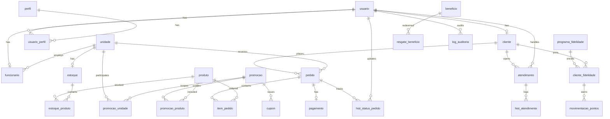

# Raizes do Nordeste

Monorepo for the Raizes do Nordeste gastronomic franchise management platform.

## Layout

```
raizes-do-nordeste/
├── apps/
│   ├── api/          NestJS backend (port 3001)
│   └── web/          Next.js 16 BFF frontend (port 4000)
├── packages/
│   └── shared/       Shared types, enums (@raizes/shared)
├── docker-compose.yml
├── turbo.json
└── pnpm-workspace.yaml
```

## Entity Relationship Diagram



## Prerequisites

- Node.js 22+
- pnpm 9.15.0
- Docker (optional)
- Remote Supabase project

## Setup

```powershell
pnpm install
Copy-Item apps/api/.env.example apps/api/.env
Copy-Item apps/web/.env.example apps/web/.env
```

Configure Supabase keys in both `.env` files.

## Development

```powershell
pnpm dev
```

Individual apps:

```powershell
pnpm --filter @raizes/api dev
pnpm --filter @raizes/web dev
```

## Build and Test

```powershell
pnpm build
$env:SUPABASE_JWT_SECRET='test-secret'
pnpm test
pnpm lint
```

## Docker

```powershell
docker compose up --build
```

- Web: http://localhost:4000
- API: http://localhost:3001

The browser talks only to the Next.js BFF at `/api/*`, which proxies to the NestJS API.

## Database

```powershell
pnpm db:generate
pnpm db:migrate
pnpm db:seed
```
